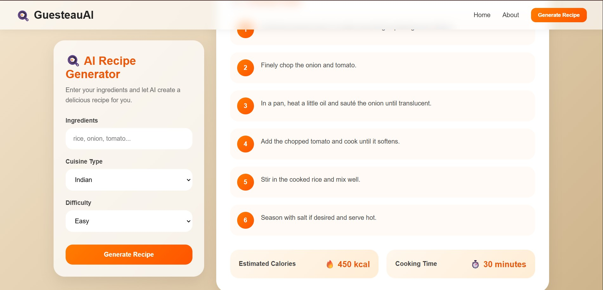

# GusteauAI - AI Powered Recipe Generation Platform

A full-stack AI-powered recipe generation application that creates personalized recipes based on user-selected ingredients, cuisine type, and difficulty level.

Built with a React frontend, Node.js/Express backend, OpenRouter API integration, and intelligent AI-generated culinary suggestions.

---

## Demo Link

[Live Demo](https://guesteau-ai-frontend.vercel.app/)

---

## Quick Start

```bash
git clone https://github.com/pawanx/gusteauAI.git
cd gusteauAI
npm install
npm run dev
```

---

## Technologies

- React JS
- Node.js
- Express.js
- OpenRouter API
- Axios
- REST APIs
- Environment Variables
- CSS3

---

## Features

## AI Recipe Generation

- Generate recipes instantly using AI
- Smart recipe creation based on selected ingredients
- Personalized recipe suggestions
- Practical and realistic cooking instructions

---

## Ingredient-Based Recipe Creation

- Enter available ingredients
- AI intelligently builds recipe combinations
- Avoids unnecessary ingredients
- Optimized for real-world cooking

---

## Cuisine Selection

- Generate recipes by cuisine type
- Supports multiple culinary styles
- Tailored recipe suggestions

Examples:
- Indian
- Italian
- Chinese
- Mexican
- Continental

---

## Difficulty Levels

Users can generate recipes based on cooking expertise:

- Easy
- Medium
- Hard

---

## Detailed Recipe Output

Each generated recipe includes:

- Recipe title
- Ingredient list
- Step-by-step cooking instructions
- Estimated calories
- Cooking time

---

## Clean Recipe Display

- Ingredient chip layout
- Step-by-step cooking cards
- Calorie estimation
- Cooking duration display
- Responsive card design

---

## Error Handling

- Input validation
- AI response validation
- JSON parsing protection
- API error handling

---

## Responsive UI

- Mobile-friendly interface
- Modern clean design
- Smooth user experience
- Interactive recipe cards

---

## Screenshots

---

## Recipe Details



---

## API References

### **POST /api/recipe/generate**

Generate AI-powered recipe

Request Body:

```json
{
  "ingredients": "tomato, onion, paneer",
  "cuisine": "Indian",
  "difficulty": "Easy"
}
```

---

Sample Response:

```json
{
  "success": true,
  "message": "Recipe generated successfully",
  "recipe": {
    "title": "Paneer Masala Delight",
    "ingredients": [
      "Paneer",
      "Tomato",
      "Onion",
      "Spices"
    ],
    "steps": [
      "Chop all vegetables.",
      "Saute onions and tomatoes.",
      "Add paneer and spices.",
      "Cook for 15 minutes."
    ],
    "calories": "450 kcal",
    "time_taken": "30 minutes"
  }
}
```

---

### **Validation Error**

```json
{
  "success": false,
  "message": "All fields are required."
}
```

---

### **Server Error**

```json
{
  "success": false,
  "message": "Failed to generate recipe."
}
```

---

## Project Architecture

### Frontend:
- React
- Component-Based UI
- Recipe State Management
- API Integration

### Backend:
- Express Server
- Controller Logic
- OpenRouter Service Layer
- Request Validation

### AI Layer:
- OpenRouter API
- Prompt Engineering
- JSON Response Parsing
- Structured Output Validation

---

## Folder Structure

```bash
gusteauAI/
│
├── frontend/
│   ├── src/
│   ├── components/
│   ├── assets/
│
├── backend/
│   ├── controllers/
│   ├── services/
│   ├── routes/
│   └── server.js
│
└── README.md
```

---

## Environment Variables

Create a `.env` file:

```env
OPENROUTER_API_KEY=your_openrouter_api_key
OPENROUTER_URL=your_openrouter_url
OPENROUTER_MODEL=your_model_name
PORT=5000
```

---

## Future Improvements

- Save favorite recipes
- Download recipe as PDF
- Recipe history
- Nutrition breakdown
- Voice-based recipe generation
- AI cooking assistant chatbot
- Ingredient substitution suggestions

---

## Contact

For bugs, collaboration, or feature requests:

📧 **Email:** pawanmishra196@gmail.com

🔗 **Portfolio:** https://portfolio-pawanx.vercel.app

💼 **LinkedIn:** https://www.linkedin.com/in/pawan-mishra-08b3b9133/